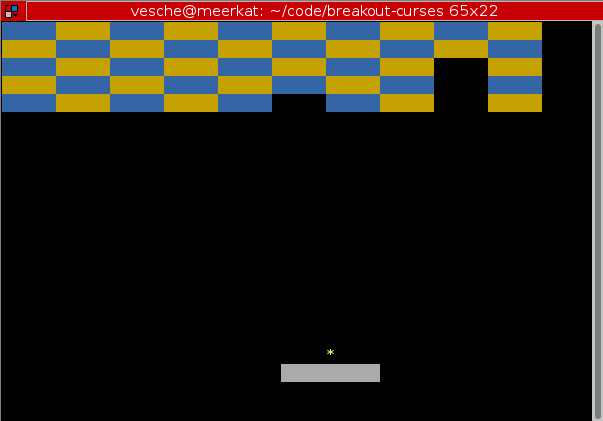

# breakout-curses

This is a primitive [breakout](https://en.wikipedia.org/wiki/Breakout_(video_game)) clone in Python that I made to learn more about curses.



To play just do:
```
$ git clone https://github.com/vesche/breakout-curses
$ cd breakout-curses
$ python breakout.py
```

## Fixing the "paddle stutter"
On most Linux terminals the keyboard auto repeat rate is going to be too high and will making playing the game difficult. To see what your current settings are run `xset -q` and look for the values `auto repeat delay` and `repeat rate`.

I recommend you adjust like so for playing: `xset -r 250 25`

## Todo
* increase paddle speed with bound checking
* collisions on sides of blocks
* fix weird counterspin paddle issues
